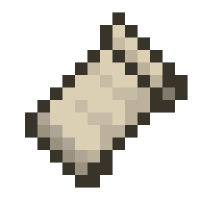

     

# MCModFixer

Normalilse API for Minecraft mod common cording.  
マインクラフトmodで共通コーディングのためのAPI平滑化。

## English

This data wraps the API for each mod loader to make it common.

Please refer to the Python code in the [HelloMCWorld](https://github.com/AZO234/HelloMCWorld) project to see how to use the data.

- Combining Minecraft and mod loader versions -> [modl_versions_xx.json](modl_versions_21.json)
- Absorbing differences in mod loader APIs -> [diff_api_xx.json](diff_api_21.json)

## Japanese / 日本語

modローダごとのAPIをラップして共通化するためのデータです。

データをどう使うかは、[HelloMCWorld](https://github.com/AZO234/HelloMCWorld) プロジェクトのPythonコードを参照して下さい。

- マインクラフトとmodローダのバージョン組み合わせ -> [modl_versions_xx.json](modl_versions_21.json)
- modローダAPIの差異を吸収 -> [diff_api_xx.json](diff_api_21.json)

## Donation / 寄付

 ☕💚

 💎✨
